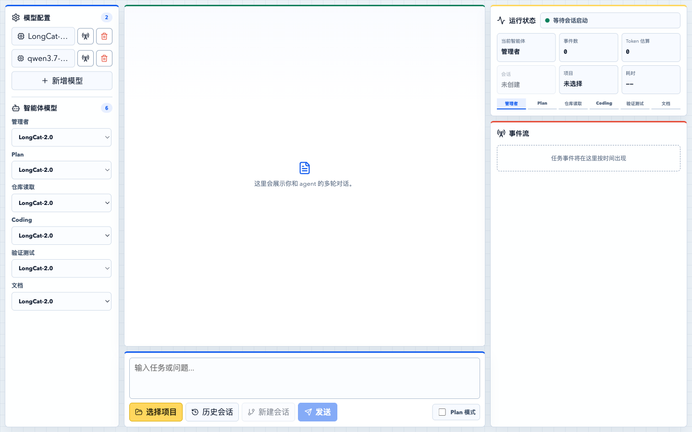

# 本地多智能体编程系统

这是一个面向单用户、本地项目开发的 Coding Agent。后端使用 FastAPI、LangGraph 和 `uv`，前端使用 React、TypeScript 和 Vite。系统采用“管理者按需路由 + Plan-Execute + Coding ReAct + 自动验证”的执行方式，普通对话不会触发仓库读取或代码修改。

当前界面以 Windows 和 macOS 的电脑浏览器为目标，移动端不属于交付范围。



## 核心能力

- 管理者先分类任务，只调用当前任务需要的智能体，不走固定流水线。
- Plan 模式支持多轮选择题澄清、保存计划、继续回答和按用户指令执行。
- 仓库读取按任务相关性选择文件，自动忽略依赖、构建产物和敏感配置。
- Coding 智能体以 ReAct 循环读取、搜索、精确替换、写入文件、查看 Git 差异和运行命令。
- 验证智能体按项目结构选择 Python 或 Node 验证命令，失败后把结果交回 Coding 修复。
- 会话、项目和全局记忆分层保存，支持历史恢复、中断识别和超长会话压缩。
- 每个智能体可单独绑定模型；模型配置支持新增、修改、删除和连通性测试。
- 浏览器工作台展示完整对话、当前智能体、事件流、token 估算、耗时、变更文件和验证结果。

## 快速启动

首次启动需要安装 Python、[`uv`](https://docs.astral.sh/uv/) 和 Node.js。

macOS 双击 `start.command`，Windows 双击 `start.bat`。启动器会在端口范围内选择空闲端口，并自动打开浏览器。

也可以在终端启动：

```bash
uv sync
uv run python scripts/dev.py
```

只启动后端命令行入口：

```bash
uv run python -m backend.cli --help
```

## 使用顺序

1. 在左侧模型配置中新增模型，并测试 API 连通性。
2. 为管理者、Plan、仓库读取、Coding、验证测试和文档智能体选择模型。
3. 点击“选择项目”选择本机目录。未选择项目时不能创建会话或发送任务。
4. 普通需求直接发送；复杂需求可先开启 Plan 模式完成澄清。
5. 从历史会话中恢复项目和会话，也可以重命名或删除对应的 memory 记录。

## 代码结构

```text
api/                    # Python/TypeScript 接口契约
backend/main.py         # FastAPI 接口、会话入口、NDJSON 流
backend/agents/         # LangGraph 编排、状态和 Prompt
backend/memory/         # 会话、项目和全局记忆
backend/tools/          # 文件、Shell 和 Git 工具边界
llm/                    # 模型配置和 OpenAI-compatible 客户端
frontend/               # React 浏览器工作台
scripts/dev.py          # 动态端口与双端启动器
tests/                  # 后端行为与安全边界测试
docs/                   # 教学、源码精读和面试文档
```

## 记忆说明

会话记录保存在 `memory/data/projects/<项目哈希>/sessions/<会话id>.jsonl`。每条记录使用简短字段和秒级 UTC 时间，例如 `2026-07-18T09:30:12Z`。项目真实路径保存在同级 `meta.json`，`project.md` 只存项目长期记忆；全局长期偏好保存在 `memory/data/global.md`。

只有用户明确表达“请记住”“以后都这样”等长期意图时，系统才会写长期记忆。一次性任务、命令输出和项目临时事实不会自动进入长期记忆。

## 验证

```bash
uv run ruff check .
uv run pytest -q

cd frontend
npm test
npm run build
```

测试代码只位于 `tests/`，不会作为 Agent 运行时数据写进模型 Prompt，也不会作为演示内容显示在前端。

## 学习文档

- [代码学习手册](docs/guide.md)：按完整调用链学习并修改项目。
- [后端源码逐步精读](docs/backend_code_reading.md)：不涉及前端，逐函数理解 Agent 后端。
- [理论与面试手册](docs/agent_interview.md)：理解 LangGraph、Plan、ReAct、Context 和 Memory。
- [交互式教学页面](docs/guide.html)：可直接双击打开的 HTML 学习页。
