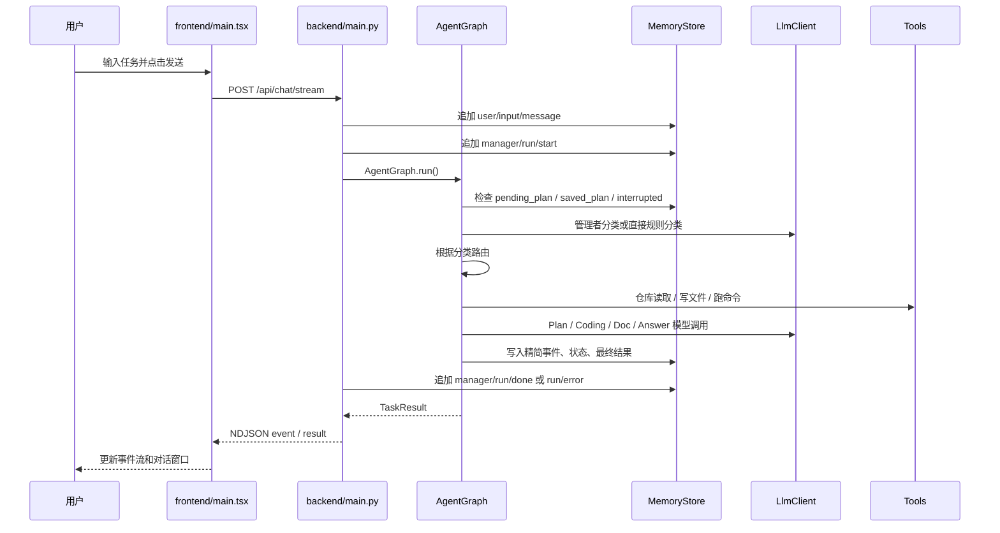
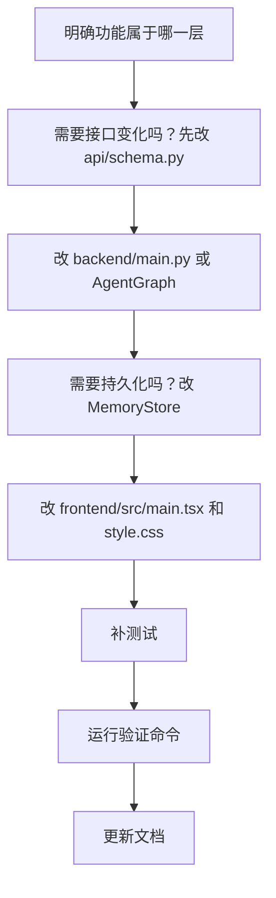

# 多智能体编程系统代码学习手册

这份文档不是项目介绍，而是代码学习手册。目标是让你读完后能理解这个项目是怎么写出来的，并能自己上手修改功能。

建议阅读方式：

1. 先看第 1 到第 4 章，建立整体调用链。
2. 再看第 5 到第 11 章，逐层理解关键代码。
3. 最后看第 12 到第 20 章，按常见需求练习修改和排查问题。

---

> 当前版本说明：本手册已按生产化加固后的代码更新。系统按单用户本地开发场景设计，不引入任务队列和多人并发控制；重点放在按需路由、真实上下文、磁盘写入正确性、工具边界、失败恢复和自动验证。

## 1. 学完后你应该能做什么

读完并跟着操作后，你应该能做到：

- 找到一次用户输入从前端到后端再到智能体的完整路径。
- 看懂 LangGraph 中每个节点什么时候被调用。
- 修改管理者智能体的任务分类逻辑。
- 修改 Plan 模式的提问、追问、确认执行逻辑。
- 新增、删除或调整一个智能体。
- 新增一个工具，让 Coding 智能体可以调用。
- 修改前端布局、对话消息、历史会话、模型配置等功能。
- 看懂 memory 目录下的会话记忆、项目记忆、全局记忆分别怎么保存。
- 知道改完功能后应该跑哪些测试。

## 2. 项目整体分层

先不要急着读每个函数。这个项目可以分成 8 层：

```mermaid
flowchart TB
    ui["frontend/src/main.tsx<br/>浏览器界面和交互状态"] --> schema["api/schema.py<br/>前后端数据结构"]
    ui --> backend["backend/main.py<br/>FastAPI 接口和流式输出"]
    backend --> graph["backend/agents/graph.py<br/>LangGraph 多智能体编排"]
    graph --> prompts["backend/agents/prompts.py<br/>每个智能体的系统提示词"]
    graph --> tools["backend/tools/<br/>文件、命令、Git 工具"]
    graph --> memory["backend/memory/store.py<br/>会话记忆和长期记忆"]
    graph --> llm["llm/<br/>模型配置和模型调用"]
    memory --> disk["memory/data/<br/>jsonl / md 记忆文件"]
    tools --> project["用户选择的项目目录"]
```

每层职责要分清：

| 层 | 主要文件 | 负责什么 |
| --- | --- | --- |
| 前端界面 | `frontend/src/main.tsx`、`frontend/src/style.css` | 展示模型配置、对话、运行状态、事件流、历史会话 |
| 接口类型 | `api/schema.py`、`api/types.ts` | 定义前后端传输的数据形状 |
| 后端入口 | `backend/main.py` | 提供 HTTP 接口，创建会话，返回流式事件 |
| 编排核心 | `backend/agents/graph.py` | LangGraph 节点、路由、智能体执行流程 |
| Prompt | `backend/agents/prompts.py` | 管理者、Plan、Coding、文档、答疑智能体的行为规则 |
| 工具层 | `backend/tools/` | 受控读写文件、执行命令、读取 Git 状态 |
| 记忆层 | `backend/memory/store.py` | 保存和读取 jsonl 会话记忆、md 长期记忆 |
| 模型层 | `llm/client.py`、`llm/store.py` | 管理模型配置，调用 OpenAI-compatible 接口 |

如果你要修改功能，先判断它属于哪一层。不要一上来全局搜索乱改。

## 3. 推荐读代码顺序

按这个顺序读，理解成本最低：

1. `api/schema.py`
2. `backend/main.py`
3. `backend/agents/graph.py`
4. `backend/memory/store.py`
5. `llm/client.py` 和 `llm/store.py`
6. `backend/tools/fs.py`、`backend/tools/shell.py`
7. `frontend/src/main.tsx`
8. `frontend/src/style.css`
9. `tests/`

原因很简单：

- `api/schema.py` 告诉你系统中有哪些数据对象。
- `backend/main.py` 告诉你外部请求怎么进来。
- `graph.py` 告诉你智能体怎么流转。
- `store.py` 告诉你为什么历史会话能恢复。
- `llm/` 告诉你模型怎么切换。
- `tools/` 告诉你 Coding 智能体真实写文件靠什么。
- `frontend/` 告诉你界面怎么触发这些接口。
- `tests/` 告诉你哪些行为已经被保护。

## 4. 一次用户发送任务的完整调用链

这是最重要的一章。只要理解这一条链，后面改功能就不会乱。



对应到代码：

| 步骤 | 文件 | 函数 |
| --- | --- | --- |
| 点击发送 | `frontend/src/main.tsx` | `runTask()` |
| 创建请求 | `frontend/src/main.tsx` | `fetch(`${API}/api/chat/stream`)` |
| 接收请求 | `backend/main.py` | `chat_stream()` |
| 创建图 | `backend/main.py` | `AgentGraph(model_store, memory_store, emit=emit)` |
| 执行图 | `backend/agents/graph.py` | `run()` |
| 管理者分类 | `backend/agents/graph.py` | `manager()`、`_classify()`、`_flow_for()` |
| LangGraph 路由 | `backend/agents/graph.py` | `route_after_manager()` 等 |
| 写文件或跑命令 | `backend/agents/graph.py` | `_do_action()` |
| 保存结果 | `backend/agents/graph.py` | `final()` |
| 前端展示结果 | `frontend/src/main.tsx` | `formatResultMessage()` |

你调试问题时，先问自己：问题发生在调用链的哪一步。

## 5. 接口类型：`api/schema.py`

这个文件定义后端接口和前端交互中用到的核心数据结构。它是项目的“合同”。

### 5.1 模型配置

```python
class ModelConfig(BaseModel):
    id: str
    name: str
    base_url: str
    api_key: str
    model: str
    ctx: int = 128000
    enabled: bool = True
    timeout: int = 120
```

这些字段对应前端新增模型表单。

如果你要新增模型参数，例如 `temperature` 或 `max_tokens`：

1. 在 `ModelConfig` 里加字段。
2. 在 `frontend/src/main.tsx` 的 `ModelConfig` 接口里加字段。
3. 在 `emptyModel()` 里给默认值。
4. 在模型弹窗表单里加输入框。
5. 在 `llm/client.py` 里把字段放进请求 payload。

### 5.2 每个智能体绑定模型

```python
AgentName = Literal["manager", "planner", "repo", "coder", "verifier", "doc"]

class AgentModelMap(BaseModel):
    manager: str = "longcat"
    planner: str = "longcat"
    repo: str = "longcat"
    coder: str = "longcat"
    verifier: str = "longcat"
    doc: str = "longcat"
```

如果新增智能体，例如 `reviewer`：

1. `AgentName` 加 `"reviewer"`。
2. `AgentModelMap` 加 `reviewer: str = "longcat"`。
3. 前端 `agents` 数组加 `{ id: "reviewer", name: "代码审查" }`。
4. `backend/agents/graph.py` 注册节点和边。
5. `backend/agents/prompts.py` 加 prompt。

### 5.3 任务请求和返回

```python
class ChatRequest(BaseModel):
    session_id: str
    text: str
    plan_mode: bool = False
    execute_plan: bool = False
    model_id: str | None = None
```

现在前端已经没有“执行计划”按钮，但字段 `execute_plan` 还保留着。它可以用于后续快捷操作或 API 调用。当前主要靠用户输入“执行计划”“开始执行”“按计划执行”触发。

```python
class TaskResult(BaseModel):
    ok: bool
    summary: str
    files: list[str]
    commands: list[str]
    tests: list[dict[str, Any]]
    plan_path: str | None
    doc_path: str | None
    tokens: int
    duration_ms: int
```

前端最终展示的 Agent 消息就是基于 `TaskResult` 格式化出来的。

## 6. 后端入口：`backend/main.py`

这个文件不要理解成“业务逻辑”。它主要负责 HTTP 层。

### 6.1 全局对象

```python
model_store = ModelStore()
memory_store = MemoryStore()
```

后端启动时创建两个全局对象：

- `ModelStore`：读写 `memory/config/models.json`。
- `MemoryStore`：读写 `memory/data/`。

### 6.2 模型相关接口

| 接口 | 函数 | 用途 |
| --- | --- | --- |
| `GET /api/models` | `list_models()` | 前端加载模型列表和智能体模型映射 |
| `POST /api/models` | `save_model()` | 新增或更新模型 |
| `DELETE /api/models/{model_id}` | `delete_model()` | 删除模型 |
| `POST /api/models/{model_id}/test` | `test_model()` | 测试模型连通性 |
| `POST /api/model-map` | `save_model_map()` | 保存每个智能体用哪个模型 |

### 6.3 会话相关接口

| 接口 | 函数 | 用途 |
| --- | --- | --- |
| `POST /api/sessions` | `create_session()` | 创建会话 jsonl |
| `GET /api/history` | `list_history()` | 读取历史项目和会话 |
| `PATCH /api/sessions/{session_id}` | `rename_session()` | 重命名会话 |
| `DELETE /api/sessions/{session_id}` | `delete_session()` | 删除会话 memory |
| `DELETE /api/projects` | `delete_project()` | 删除项目 memory |

注意：删除项目和会话只删除 agent 自己的 memory，不删除用户真实项目目录。

### 6.4 选择项目目录

```python
@app.post("/api/pick-dir")
def pick_dir() -> dict[str, str]:
    selected = _pick_dir_by_system_dialog()
    if not selected:
        selected = _pick_dir_by_tkinter()
```

macOS 用 `osascript`，Windows 用 PowerShell，其他情况尝试 `tkinter`。

如果“选择项目”失败，通常要看：

- 后端是不是最新进程。
- 系统是否允许当前终端拉起文件选择器。
- 当前环境有没有图形界面。

### 6.5 最核心接口：`chat_stream()`

```python
@app.post("/api/chat/stream")
def chat_stream(req: ChatRequest) -> StreamingResponse:
```

这个函数做了几件事：

1. 根据 `session_id` 反查 `workdir`。
2. 在写入当前输入前判断上一轮是否异常中断，再把输入和 `run/start` 写进会话记忆。
3. 创建 `event_queue`，开一个后台线程运行 `AgentGraph`。
4. 每 15 秒输出 heartbeat，防止长任务被代理层误判为空闲连接。
5. 成功时写入 `run/done`；异常时把可恢复的错误结果和 `run/error` 一起持久化。
6. 把事件和最终结果用 NDJSON 流式返回给前端。

为什么用队列和线程？

- `AgentGraph.run()` 可能执行很久。
- 前端希望实时看到事件流。
- `StreamingResponse` 需要不断 `yield` 数据。
- 后台线程负责跑任务，主生成器负责读队列并输出。

NDJSON 的每一行大致是：

```json
{"type":"event","data":{"agent":"coder","kind":"tool","msg":"写入文件：index.html"}}
```

或者：

```json
{"type":"result","data":{"ok":true,"summary":"任务完成","files":[]}}
```

前端 `runTask()` 会逐行解析。

## 7. 编排核心：`backend/agents/graph.py`

这是项目最重要的文件。它定义了智能体如何工作。

### 7.1 图结构

`_build()` 里注册节点：

```python
graph.add_node("manager", self.manager)
graph.add_node("planner", self.planner)
graph.add_node("repo", self.repo)
graph.add_node("answer", self.answer)
graph.add_node("coder", self.coder)
graph.add_node("verifier", self.verifier)
graph.add_node("doc", self.doc)
graph.add_node("final", self.final)
```

然后注册边：

```mermaid
flowchart TB
    start["START"] --> manager["manager"]
    manager --> planner["planner"]
    manager --> repo["repo"]
    manager --> answer["answer"]
    manager --> final["final"]
    planner --> repo
    planner --> final
    repo --> coder["coder"]
    repo --> doc["doc"]
    repo --> answer
    repo --> final
    coder --> verifier["verifier"]
    verifier --> coder
    verifier --> doc
    verifier --> final
    doc --> final
    answer --> final
    final --> end["END"]
```

这里有一个关键点：它不是固定流水线。

例如：

- “你好”只走 `manager -> final`。
- “解释这个报错”可能走 `manager -> repo -> answer -> final`。
- “生成 README”走 `manager -> repo -> doc -> final`。
- “创建一个系统”走 `manager -> repo -> coder -> verifier -> final`。
- “创建一个系统并生成文档”走 `manager -> repo -> coder -> verifier -> doc -> final`。
- Plan 模式先走 `manager -> planner -> final`，用户确认后再进入代码流程。

### 7.2 `run()` 初始化状态

```python
state: AgentState = {
    "session_id": session_id,
    "workdir": workdir,
    "text": text,
    "plan_mode": plan_mode,
    "execute_plan": execute_plan,
    "changes": [],
    "commands": [],
    "tests": [],
    "tests_ok": True,
    "retry": 0,
    "tokens": 0,
    "coding_ok": True,
    "coding_summary": "",
    "resuming": False,
    "started_at": 0.0,
    "error": "",
}
```

LangGraph 节点之间传递的是这个 `state`。

新增某个跨节点字段时，要同时检查：

- `backend/agents/types.py`
- `AgentGraph.run()`
- 读写这个字段的节点
- 测试

### 7.3 管理者智能体：`manager()`

管理者做四件事：

1. 检查上次会话是否异常中断。
2. 检查是否存在 pending Plan。
3. 检查是否存在已保存计划并且用户确认执行。
4. 对普通输入分类并决定下一步路由。

核心代码逻辑：

```python
pending_plan = self._latest_pending_plan(workdir, session_id)
saved_plan = self._latest_saved_plan(workdir, session_id)

if pending_plan and self._is_plan_cancel(state["text"]):
    ...
elif pending_plan and self._should_treat_as_plan_reply(...):
    ...
elif saved_plan and self._is_execute_plan_text(state["text"]):
    ...
else:
    classification = self._classify(state)
```

这就是之前 Plan 回复 `1A, 2A, 3A` 没上下文问题的关键修复点。现在它会先查 `pending_plan`，再把原始需求、上一轮问题、用户答案拼成新的任务文本。

### 7.4 任务分类：`_classify()`

`_classify()` 先用确定性规则处理高频情况：

- Plan 模式已开启。
- 空输入、问候、感谢、询问能力。
- 创建系统、应用、页面、接口等代码生成任务。
- 文档任务。
- 修改、修复、重构任务。
- 解释、报错任务。

只有规则覆盖不到时，才调用管理者模型。

这很重要。普通“你好”不应该浪费模型，也不应该读仓库。

如果你要修“管理者误调用智能体”的问题，优先改这里。

### 7.5 路由决策：`_flow_for()`

`_classify()` 只负责判断类型，`_flow_for()` 负责把类型变成 LangGraph 路由。

```python
if task_type == "direct":
    return "final", "final", "final"
if task_type == "doc_gen":
    return "repo", "doc", "final"
if task_type == "code_explain":
    return "repo", "answer", "final"
if task_type in {"code_gen", "code_mod"}:
    after_verify = "doc" if need_doc else "final"
    return "repo", "coder", after_verify
```

返回值含义：

| 返回值 | 含义 |
| --- | --- |
| `route` | 管理者后下一步去哪 |
| `after_repo` | 仓库读取后去哪 |
| `after_verify` | 验证通过后去哪 |

如果你要新增一种任务类型，例如 `code_review`，通常要同时改 `_classify()` 和 `_flow_for()`。

### 7.6 Context Package

管理者会构造 `ContextPackage`：

```python
ctx = ContextPackage(
    goal=state["text"],
    task_type=task_type,
    workdir=workdir,
    plan_mode=bool(state.get("plan_mode")),
    project_memory=...,
    global_memory=...,
    constraints=[...],
    recent=[...],
)
```

下游智能体不直接读取全部历史，而是读取这个上下文包。

这能避免几个问题：

- 历史太长，模型上下文浪费。
- 无关对话干扰当前任务。
- 子智能体拿到不该拿的全部记忆。

如果你要给下游智能体增加信息，例如“当前用户偏好测试框架”，应该加到 `ContextPackage` 或它的构造逻辑里。

### 7.7 仓库读取智能体：`repo()`

`repo()` 做的是任务相关仓库扫描，不是把整个项目塞给模型。

它会：

1. `FsTool.list()` 最多列出 1200 个源码候选，并忽略 `.git`、`node_modules`、`.venv`、构建目录和缓存目录。
2. `_repo_candidates()` 根据入口文件、文件名、目录名和用户需求关键词计算相关性。
3. 只读取排序靠前的相关文件，仓库摘要总量限制在约 60000 字符。
4. 跳过 `.env`、私钥、凭据、模型配置等敏感文件。
5. 用 `_detect_stack()` 识别技术栈；Coding 后续仍可用搜索和分段读取补充上下文。

如果你发现 Coding 智能体缺少某些上下文，优先改 `repo()` 的优先文件列表或读取策略。

### 7.8 Plan 智能体：`planner()`

Plan 智能体只在 Plan 模式或 pending Plan 流程中工作。

模型应该返回两种 JSON 之一：

```json
{
  "status": "questions",
  "questions": []
}
```

或者：

```json
{
  "status": "plan",
  "title": "计划标题",
  "markdown": "完整 Markdown 计划"
}
```

如果返回问题：

- `_normalize_plan_questions()` 清洗问题。
- `_format_plan_questions()` 转成用户可读文本。
- `MemoryStore.append()` 保存 `pending_plan`。

如果返回计划：

- 写入 `<项目目录>/docs/plans/<会话id>.md`。
- 保存 `plan_done` 状态。
- 等用户发送“执行计划”。

### 7.9 Coding 智能体：`coder()`

Coding 智能体是 ReAct 循环。

每一轮：

1. 组装任务摘要、仓库清单、失败清单、当前文件快照和最近工具观察。
2. 普通兼容模型调用 `client.chat_json()`；LongCat 直接使用普通文本请求和原生工具标签，避免 `response_format` 返回空对象。
3. 读取统一后的 `thought`、`actions`、`done` 和 `summary`。
4. 对每个 action 校验必填参数，再调用 `_do_action()`。
5. 把工具结果压缩成带成功状态、退出码和关键输出的权威 observation。
6. 单次 Coding 最多执行 16 步；连续三次无法得到可执行结构才结束本次尝试。
7. 去重已经执行或拒绝过的动作；修改文件后由编排器立即从磁盘刷新快照，下一轮可直接继续修改，不再额外请求 `read_file`。
8. 任一工具失败都会保留在 observations 中，模型不能仅凭 `done=true` 把失败任务报告为成功。

为了避免长任务上下文反复膨胀，单个当前文件快照最多保留 24,000 字符，全部快照共用 48,000 字符预算；普通工具观察只保留最近六条精简结果。Coding 单轮输出最多 6,000 token；模型超时后只保留任务明确点名的文件快照。验证失败重试时，Coder 会从磁盘重新读取错误涉及的文件，而不是重新发送最初的旧仓库片段。

模型返回格式：

```json
{
  "thought": "本轮判断，中文",
  "actions": [
    {"tool": "search_files", "query": "旧函数名"},
    {"tool": "read_file", "path": "src/app.py", "start": 0, "max_chars": 24000},
    {"tool": "replace_file", "path": "src/app.py", "old": "旧文本", "new": "新文本", "expected": 1},
    {"tool": "replace_block", "path": "src/app.py", "start_marker": "唯一开始标记", "end_marker": "下一个边界或空字符串", "content": "新的完整代码块"},
    {"tool": "run_command", "cmd": "python -m py_compile app.py"}
  ],
  "done": false,
  "summary": ""
}
```

注意：Coding 智能体必须真实写磁盘，不是只输出代码片段。

LongCat 模型不会被强迫伪装成 JSON 工具调用。`LONGCAT_CODER_SUFFIX` 要求它返回 `<longcat_tool_call>`、`<longcat_arg_key>` 和 `<longcat_arg_value>` 标签，`LlmClient` 再把这些标签转换成上面的统一 actions。这样模型差异只停留在封装层，`coder()` 和 `_do_action()` 仍使用同一种内部协议。

### 7.10 工具执行：`_do_action()`

支持的工具：

| tool | 实际调用 | 说明 |
| --- | --- | --- |
| `write_file` | `FsTool.write()` | 写完整文件 |
| `append_file` | `FsTool.append()` | 追加文件 |
| `replace_file` | `FsTool.replace()` | 按预期匹配次数精确替换，避免覆盖整文件 |
| `replace_block` | `FsTool.replace_block()` | 用唯一边界替换长函数或章节，不复制整段旧内容 |
| `read_file` | `FsTool.read()` | 按起始行和行数分段读取文件 |
| `list_files` | `FsTool.list()` | 列文件 |
| `search_files` | `FsTool.search()` | 搜索文本并返回文件、行号和片段 |
| `run_command` | `ShellTool.run()` | 执行命令 |
| `git_status` | `GitTool.status()` | 查看 Git 状态 |
| `git_diff` | `GitTool.diff()` | 查看当前未提交差异 |

如果你要给 Coding 新增工具，例如 `replace_file`：

1. 在 `backend/tools/fs.py` 增加方法。
2. 在 `_do_action()` 增加分支。
3. 在 `CODER_PROMPT` 里说明工具 JSON 格式。
4. 写测试覆盖。

### 7.11 验证智能体：`verifier()`

验证智能体根据文件结构选择命令：

| 项目特征 | 验证方式 |
| --- | --- |
| 有 Python 文件 | 对源码目录运行 `python -m compileall -q` |
| 存在 Python 测试 | `uv run pytest -q` |
| 无 `package.json` 的静态 JavaScript | 对主入口运行 `node --check` |
| 有 `package.json` | 读取 scripts 后依次选择 `lint`、`test`、`typecheck`、`build` |
| 有静态 Web 文件 | 静态 Web 接线检查 |

如果 Coding 自己失败，验证状态不会被默认值覆盖成成功。代码任务验证失败且总尝试次数不足 3 次时，会把结构化失败结果交回 `coder` 修复；用户明确要求的 `verify` 只读任务无论成功或失败都直接返回，绝不会进入 Coding。语义审查在 60,000 字符总预算内优先完整读取普通源码，不能把提示词截断误判成磁盘文件损坏。

这段逻辑在：

```python
def route_after_verifier(self, state: AgentState) -> str:
    if state.get("task_type") == "verify":
        return "final"
    if not state.get("tests_ok", True) and int(state.get("retry", 0)) < 3:
        return "coder"
```

如果你要增加 Playwright 或 Ruff 验证，应该改 `verifier()`。

### 7.12 文档智能体：`doc()`

文档智能体调用 `DOC_PROMPT`，要求模型返回：

```json
{
  "path": "README.md",
  "content": "完整 Markdown 内容",
  "summary": "文档变更摘要"
}
```

然后通过 `FsTool.write()` 写入用户项目目录。

注意：如果模型给了绝对路径，代码会改成 `README.md`，防止写出项目目录。

### 7.13 最终结果：`final()`

`final()` 把当前状态整理成 `TaskResult`：

```python
result = {
    "ok": coding_ok and tests_ok,
    "summary": summary,
    "files": state.get("changes", []),
    "commands": state.get("commands", []),
    "tests": state.get("tests", []),
    "plan_path": ...,
    "doc_path": ...,
    "tokens": state.get("tokens", 0),
    "duration_ms": ...,
}
```

然后：

1. 写入 `manager/final/result` 记忆。
2. 必要时压缩会话记忆。
3. 发出最终事件。
4. 返回给前端。

历史会话里恢复的 Agent 回复，就是从这条 final 记录格式化出来的。

## 8. 记忆系统：`backend/memory/store.py`

memory 是这个项目能恢复历史会话、判断中断、继续 Plan 的核心。

### 8.1 目录结构

```text
memory/
  config/
    models.json
  data/
    global.md
    projects/
      <项目路径哈希>/
        meta.json
        project.md
        sessions/
          <会话id>.jsonl
```

`meta.json` 保存真实项目路径，`project.md` 只保存项目长期记忆。旧版本把路径混在 `project.md`，当前代码仍兼容读取，但新项目不会继续混写。

为什么项目目录用哈希？

- 用户项目路径可能包含中文、空格、特殊字符。
- 直接用路径做目录名不安全。
- `project_id()` 用项目绝对路径生成 12 位 sha1。

### 8.2 会话记忆格式

每条记录是 jsonl 一行：

```json
{
  "id": 1,
  "ts": "2026-07-02T00:00:00Z",
  "ag": "manager",
  "tl": "classify",
  "k": "context",
  "out": "任务分类：code_gen",
  "m": {}
}
```

短字段含义：

| 字段 | 含义 |
| --- | --- |
| `id` | 会话内递增 id |
| `ts` | 精简到秒的 UTC 时间戳 |
| `ag` | agent 名称 |
| `tl` | 工具或阶段 |
| `k` | 记录类型 |
| `out` | 文本输出 |
| `m` | 结构化元数据 |

### 8.3 为什么历史会话能恢复

前端点历史会话时调用：

```text
GET /api/history
```

后端调用：

```python
memory_store.list_history()
```

`list_history()` 会扫描所有项目目录，再扫描每个项目下的 `sessions/*.jsonl`；进程内会维护会话索引，避免每次请求都做重复的全量定位。

每个会话会通过 `_history_messages()` 提取两类消息：

- 用户输入：`ag=user`、`tl=input`、`k=message`
- Agent 最终回复：`ag=manager`、`tl=final`、`k=result`

所以事件流不会被恢复到对话窗口里，对话窗口只恢复用户消息和最终回复。

### 8.4 pending Plan 怎么保存

Plan 智能体提出问题后，会写入：

```python
memory.append(
    workdir,
    session_id,
    "planner",
    "state",
    "pending_plan",
    "Plan 问题等待用户回答",
    {...}
)
```

下一次用户回复时，管理者通过 `_latest_pending_plan()` 从会话记忆里倒序查找最新 pending Plan。

如果用户输入 `1A, 2A, 3A`，管理者就能知道这不是普通输入，而是在回答上一轮 Plan 问题。

### 8.5 中断判断

当前实现优先检查成对的 `manager/run/start` 与 `manager/run/done|error`，因此会话重命名等管理记录不会被误判成中断。对旧会话没有运行生命周期记录时，才回退到“最后是否存在最终结果”的兼容逻辑。

### 8.6 压缩策略

`maybe_compress()` 用简单估算判断会话是否超过模型上下文 85%。

压缩时优先把连续工具日志折叠为阶段摘要，重复命令只保留最新结果，同时保留用户消息、最终回复、Plan 状态和运行生命周期。仍超过 85% 时才按组丢弃最早阶段，写回过程使用原子替换，避免中途损坏 jsonl。

下游智能体不会直接读取全部记录。`conversation_context()` 只提取用户消息和 Agent 最终回复，并按条数、字符预算裁剪；事件流和工具输出不会伪装成对话上下文。

长期记忆也不是每轮自动写入。只有用户明确使用“请记住”“以后都这样”等长期表达时才调用 `remember()`，项目临时事实和一次性命令结果不会进入长期记忆。

## 9. 模型层：`llm/`

### 9.1 模型配置：`llm/store.py`

`ModelStore` 负责读写：

```text
memory/config/models.json
```

核心方法：

| 方法 | 作用 |
| --- | --- |
| `all()` | 读取全部模型 |
| `get(model_id)` | 按 id 找模型 |
| `for_agent(agent, override)` | 找某个智能体应该用的模型 |
| `upsert(cfg)` | 新增或更新模型 |
| `delete(model_id)` | 删除模型，并修复智能体映射 |
| `set_model_map(model_map)` | 保存智能体模型映射 |

### 9.2 模型调用：`llm/client.py`

`LlmClient` 负责 OpenAI-compatible 请求。

它会尝试这些地址：

1. 如果 base_url 已经是 `/chat/completions`，直接使用。
2. 如果 base_url 以 `/v1` 结尾，拼 `/chat/completions`。
3. 否则依次尝试：
   - `<base_url>/v1/chat/completions`
   - `<base_url>/chat/completions`

这样用户填：

```text
https://api.longcat.chat/openai
```

也能兼容。

### 9.3 `chat()` 和 `chat_json()`

`chat()` 返回普通文本，并在连接错误、限流或可恢复的 5xx 响应上做有限重试。候选 URL 共用同一个连接池，并缓存已经成功的接口地址。

当模型名称包含 `longcat` 时，请求自动启用 `stream=true`。客户端逐行读取 OpenAI-compatible SSE 分片，把 `delta.content` 拼成完整文本，并忽略只携带 usage、心跳或空 `choices` 的分片。流式读取仍有总时长和 100,000 字符正文上限，防止服务持续发心跳导致任务永不结束。这里的流式只用于模型客户端稳定接收长响应，前端最终消息仍由 Agent 节点完成后统一返回。

`chat_json()` 做了额外容错：

- 去掉 ```json 代码块。
- 使用字符串感知的括号平衡扫描，提取第一个完整 JSON 对象。
- 识别 LongCat 原生工具标签并转换成统一 ReAct actions。
- 当接口不支持 `response_format` 或省略标准 content 时，退回普通文本请求。
- `json.loads()` 解析。
- 失败就抛 `LlmError`。

管理者、Plan、Coding、文档智能体大量依赖 JSON 输出，所以 prompt 必须写得非常明确。

## 10. 工具层：`backend/tools/`

工具层是 agent 真正触碰磁盘和系统命令的地方。

### 10.1 文件工具：`FsTool`

`FsTool.safe()` 是安全边界：

```python
path = (self.root / rel).resolve()
if self.root != path and self.root not in path.parents:
    raise ValueError(...)
```

这样 Coding 智能体只能读写用户选择的项目目录内部。

### 10.2 命令工具：`ShellTool`

`ShellTool.run()` 会拒绝明显危险命令：

```python
dangerous = {
    "rm",
    "rmdir",
    "del",
    "erase",
    "format",
    "mkfs",
    "shutdown",
    "reboot",
    "git reset",
    "git checkout --",
}
```

当前实现是直接拒绝。更完整的产品化方案是：

1. 工具返回 `requires_confirmation`。
2. 后端暂停当前任务。
3. 前端弹出确认。
4. 用户确认后继续执行。

如果你要做这个功能，主要改 `ShellTool.run()`、`AgentGraph._do_action()`、前端流式任务状态。

此外，`ShellTool` 会移除不属于所选项目的 `VIRTUAL_ENV`，给 `uv init` 自动补 `--no-workspace`。如果所选目录没有自己的 `.git`，除 `git init` 外的 Git 命令会被拒绝，防止 Git 向上找到 Coding Agent 自身仓库并把父项目状态误当成用户项目状态。

## 11. 前端：`frontend/src/main.tsx`

前端目前集中在一个文件里。虽然文件较长，但逻辑可以分成 6 块。

### 11.1 顶部类型定义

前端从独立契约文件 `api/types.ts` 导入与后端对应的 TypeScript 类型：

```ts
import type {
  AgentEvent,
  AgentModelMap,
  HistoryProject,
  ModelConfig,
  TaskResult
} from "../../api/types";
```

如果后端 schema 变了，这里通常也要跟着变。

### 11.2 状态管理

主要状态：

| state | 说明 |
| --- | --- |
| `models` | 模型列表 |
| `modelMap` | 每个智能体使用哪个模型 |
| `workdir` | 当前项目目录 |
| `sessionId` | 当前会话 id |
| `sessionTitle` | 当前会话显示名 |
| `task` | 输入框内容 |
| `planMode` | 是否开启 Plan 模式 |
| `running` | 当前是否有任务在跑 |
| `events` | 右侧事件流 |
| `messages` | 中间对话消息 |
| `historyProjects` | 历史项目和会话 |

如果界面显示异常，先看对应状态是怎么变化的。

### 11.3 模型配置功能

相关函数：

| 函数 | 作用 |
| --- | --- |
| `loadModels()` | 拉取模型列表 |
| `saveModel()` | 保存模型 |
| `deleteModel()` | 删除模型 |
| `testModel()` | 测试模型连通性 |
| `saveMap()` | 保存智能体模型映射 |

新增模型弹窗由 `modelModalOpen` 控制。

### 11.4 项目和会话功能

相关函数：

| 函数 | 作用 |
| --- | --- |
| `pickProject()` | 调用 `/api/pick-dir` |
| `createSession()` | 调用 `/api/sessions` |
| `openHistory()` | 调用 `/api/history` |
| `restoreSession()` | 恢复历史会话到当前页面 |
| `renameCurrentSession()` | 修改会话名称 |
| `deleteHistorySession()` | 删除会话 memory |
| `deleteHistoryProject()` | 删除项目 memory |

未选择项目时不能新建会话，是在 `createSession()` 和按钮 `disabled={!workdir}` 两处控制。

### 11.5 发送任务：`runTask()`

这个函数是前端最关键的逻辑：

```ts
async function runTask() {
  const trimmedTask = task.trim();
  const id = sessionId || (await createSessionAndReturnId());
  setMessages((prev) => [...prev, { role: "user", content: trimmedTask }]);
  const res = await fetch(`${API}/api/chat/stream`, ...);
  const reader = res.body?.getReader();
  while (...) {
    const item = JSON.parse(line);
    if (item.type === "event") setEvents(...);
    if (item.type === "result") setMessages(...);
    if (item.type === "error") setMessages(...);
  }
}
```

它负责：

1. 校验输入。
2. 没有会话时自动创建会话。
3. 先把用户消息插入对话窗口。
4. 调用流式接口。
5. 逐行解析 NDJSON。
6. event 加到右侧事件流。
7. result 格式化成 Agent 消息；Markdown、GFM 表格和代码块由 `react-markdown` 安全渲染。
8. HTTP 错误、残余 NDJSON、后台持久化错误和 `finally` 状态都会被处理，不会出现“请求失败但界面仍显示运行中”。

如果 Agent 最终回复展示不对，优先看 `formatResultMessage()`。

如果流式事件不显示，优先看 `runTask()` 里的 reader 解析。

### 11.6 布局和消息样式

页面结构：

```text
main.shell
  section.grid
    aside.panel.side
    section.panel.chat-panel
    aside.right-col
    section.composer
```

消息结构：

```tsx
<div className={`message-row ${msg.role}`}>
  <article className={`bubble ${msg.role}`}>
    <span>{msg.role === "user" ? "用户" : "Agent"}</span>
    <p>{msg.content}</p>
  </article>
  <button className="copy-message">...</button>
</div>
```

所以消息框样式主要看：

- `.message-row`
- `.bubble`
- `.bubble.user`
- `.bubble.agent`
- `.copy-message`

之前 Agent 消息外面出现椭圆，是因为全局 `.agent` 样式误伤了消息气泡。修这类问题时要注意 CSS 选择器作用域。

## 12. 启动脚本：`scripts/dev.py`

这个脚本让项目可以简单启动。

主要逻辑：

1. `pick_port(8710, 8730)` 找后端端口。
2. `pick_port(5173, 5199)` 找前端端口。
3. 设置环境变量：
   - `BACKEND_PORT`
   - `FRONTEND_PORT`
   - `VITE_API_URL`
4. 如果 `frontend/node_modules` 不存在，执行 `npm install`。
5. 启动 uvicorn。
6. 启动 Vite。
7. 等待两个端口真正可用后自动打开浏览器；设置 `AGENT_NO_BROWSER=1` 可关闭自动打开。
8. 监听 Ctrl+C，同时关闭前后端。

如果你要改端口范围，就改这里。

## 13. 常见功能修改应该改哪里

这一章是实践索引。以后你想改功能，先看这里。

### 13.1 修改“你好”这类普通输入的行为

改：

- `backend/agents/graph.py`
  - `_direct_reply()`
  - `_classify()`
- `tests/test_agent.py`

重点：

- 普通问候必须只走 `manager -> final`。
- 不应该读仓库。
- 不应该写文件。
- 不应该生成 README。

验证：

```bash
uv run pytest tests/test_agent.py
```

### 13.2 修改任务分类规则

改：

- `backend/agents/graph.py`
  - `_classify()`
  - `_flow_for()`
- `backend/agents/prompts.py`
  - `MANAGER_PROMPT`

建议：

- 高频、确定的规则写在 Python 里。
- 模糊分类才交给模型。
- 改完必须加测试，防止又变成流水线。

### 13.3 修改 Plan 模式

改：

- `backend/agents/graph.py`
  - `planner()`
  - `_normalize_plan_questions()`
  - `_format_plan_questions()`
  - `_latest_pending_plan()`
  - `_should_treat_as_plan_reply()`
  - `_build_plan_reply()`
  - `_compose_pending_plan_text()`
  - `_is_execute_plan_text()`
- `backend/agents/prompts.py`
  - `PLANNER_PROMPT`
- `tests/test_agent.py`

如果问题是“回复 1A 后没有上下文”，看：

1. 是否保存了 `pending_plan`。
2. `_latest_pending_plan()` 是否能读到。
3. `_should_treat_as_plan_reply()` 是否返回 True。
4. `_compose_pending_plan_text()` 是否把原始需求拼回去了。

### 13.4 新增一个智能体

假设新增 `reviewer` 智能体：

1. `api/schema.py`
   - `AgentName` 加 `"reviewer"`。
   - `AgentModelMap` 加 `reviewer`。
2. `frontend/src/main.tsx`
   - `AgentName` 类型加 `"reviewer"`。
   - `modelMap` 默认值加 `reviewer`。
   - `agents` 数组加显示名。
3. `backend/agents/prompts.py`
   - 加 `REVIEWER_PROMPT`。
4. `backend/agents/types.py`
   - 如果需要新状态，加字段。
5. `backend/agents/graph.py`
   - `_build()` 注册节点。
   - 写 `reviewer()` 方法。
   - 修改路由函数。
6. `tests/`
   - 加路由测试。

### 13.5 新增一个 Coding 工具

假设新增 `replace_file`：

1. `backend/tools/fs.py`
   - 实现 `replace()`。
2. `backend/agents/graph.py`
   - `_do_action()` 增加 `if tool == "replace_file"`。
3. `backend/agents/prompts.py`
   - `CODER_PROMPT` 里加工具说明。
4. `tests/`
   - 测工具不能写出工作目录。
   - 测 `_do_action()` 能调用成功。

注意：工具必须受 `workdir` 限制，不能让模型写到任意路径。

### 13.6 修改验证命令

改：

- `backend/agents/graph.py`
  - `verifier()`
  - `_static_web_check()`
  - `route_after_verifier()`
- `tests/test_verifier.py`

例子：

- 想加 `ruff`：检测 `pyproject.toml` 后追加 `uv run ruff check .`。
- 想加前端构建：检测 `package.json` 后追加 `npm run build`。
- 想加浏览器测试：新增 Playwright 命令，但要考虑安装成本和执行时间。

### 13.7 修改历史会话展示

后端改：

- `backend/memory/store.py`
  - `list_history()`
  - `_session_summary()`
  - `_history_messages()`
  - `_session_title()`

前端改：

- `frontend/src/main.tsx`
  - `openHistory()`
  - `restoreSession()`
  - 历史弹窗 JSX

如果历史会话为空，先检查 `memory/data/projects/` 里有没有项目目录。

### 13.8 修改前端消息气泡

改：

- `frontend/src/main.tsx`
  - 消息 JSX
- `frontend/src/style.css`
  - `.message-row`
  - `.bubble`
  - `.copy-message`
  - `.chat-window`

注意：

- 用户消息和 Agent 消息应该使用同一种结构。
- 颜色可以不同，形状不要不同。
- 长文本用消息内部滚动，不要撑乱整个页面。
- 复制按钮放在消息框外部右下角。

### 13.9 修改模型配置表单

后端改：

- `api/schema.py`
- `llm/store.py`
- `llm/client.py`

前端改：

- `frontend/src/main.tsx`
  - `ModelConfig`
  - `emptyModel()`
  - 模型弹窗表单

验证：

- 前端保存模型。
- 点击测试连通性。
- 检查 `memory/config/models.json`。

### 13.10 修改选择项目目录

改：

- `backend/main.py`
  - `pick_dir()`
  - `_pick_dir_by_system_dialog()`
  - `_pick_dir_by_tkinter()`
- `frontend/src/main.tsx`
  - `pickProject()`

如果后端返回 `Not Found`，通常说明浏览器连着旧后端进程，而不是当前代码里的接口真的不存在。

## 14. 新增功能的标准流程

以后你自己加功能，建议按这个顺序：



具体步骤：

1. 写一句话说明功能目标。
2. 判断是否影响接口类型。
3. 判断是否影响 LangGraph 路由。
4. 判断是否需要写 memory。
5. 判断前端需要哪些状态。
6. 写最小代码。
7. 写测试保护关键行为。
8. 跑测试。
9. 更新文档。

不要一开始就改 UI。这个项目的核心是编排和状态流，UI 只是入口和展示。

## 15. 当前测试怎么读

测试不是摆设，它告诉你哪些行为不能破坏。

### 15.1 `tests/test_agent.py`

重点覆盖：

- 普通问候不读仓库、不写文件。
- 创建代码且要求文档时，路由到 Coding 后再到 Doc。
- 纯文档任务不走 Coding。
- Plan 问题要格式化成用户能读的选择题。
- 模型 JSON 异常不能原样展示给用户。
- Plan 选项回复要带上上下文。
- 用户可以取消 pending Plan。
- 用户可以执行已保存计划。

### 15.2 `tests/test_memory.py`

重点覆盖：

- 中断会话判断。
- 会话压缩。
- 历史消息恢复。
- 没有自定义名称时展示 session id。
- 删除会话和项目 memory。
- 秒级时间戳迁移、真实对话上下文和运行生命周期。

### 15.3 `tests/test_tools.py` 和 `tests/test_llm.py`

重点覆盖：

- 依赖目录不会进入仓库摘要。
- 精确替换、文本搜索和敏感文件拦截。
- 复合 shell、直接或嵌套解释器内联代码会被拒绝。
- 子项目中的 uv、虚拟环境和 Git 不会越过用户选择的项目边界。
- 模型解释文字中的 JSON 能正确处理字符串内部花括号。
- LongCat 原生工具标签、完成标签、SSE 空 choices 和流式正文拼接能够正确处理。

### 15.4 建议每次修改后跑什么

只改文档：

```bash
rg -n "TODO|FIXME" docs/guide.md
```

改后端编排或 memory：

```bash
uv run pytest tests/test_agent.py tests/test_memory.py
uv run ruff check .
```

改前端：

```bash
cd frontend
npm test
npm run build
```

改全链路：

```bash
uv run pytest
uv run ruff check .
cd frontend
npm test
npm run build
```

## 16. 从零理解这个项目是怎么写出来的

如果你想学习“作者是如何从 0 写出这个项目的”，可以按这个构建顺序复盘。

### 16.1 第一步：先定义数据结构

先写 `api/schema.py`。

原因：

- 没有数据结构，前后端会互相猜。
- 智能体事件、任务结果、会话历史都要有稳定格式。
- 后面写 FastAPI 和 React 时都围绕这些结构展开。

### 16.2 第二步：写模型封装

写 `llm/store.py` 和 `llm/client.py`。

先解决：

- 模型配置存哪里。
- 怎么按智能体选择模型。
- 怎么调用 OpenAI-compatible 接口。
- 模型不返回 usage 时怎么估算 token。
- 模型返回 JSON 不稳定时怎么处理。

### 16.3 第三步：写 memory

写 `backend/memory/store.py`。

先把这些能力做好：

- 创建项目 memory。
- 创建会话 jsonl。
- 追加事件。
- 读取历史。
- 识别中断。
- 压缩会话。

原因：多智能体系统最容易出问题的是状态丢失。先把记忆层写稳，后面 Plan 和历史会话才好做。

### 16.4 第四步：写工具层

写 `backend/tools/fs.py` 和 `backend/tools/shell.py`。

重点不是功能多，而是安全：

- 文件工具必须限制在项目目录内。
- Shell 工具必须拒绝危险命令。
- 工具返回要结构化，方便 Coding 智能体观察。

### 16.5 第五步：写 AgentGraph

先写最小图：

```text
manager -> final
```

再加：

```text
manager -> repo -> answer -> final
manager -> repo -> coder -> verifier -> final
manager -> planner -> final
manager -> repo -> coder -> verifier -> doc -> final
```

每加一条路由，就补一条测试。

### 16.6 第六步：写 FastAPI

写 `backend/main.py`。

先提供：

- 健康检查。
- 模型配置接口。
- 会话接口。
- 历史接口。
- 流式任务接口。

`/api/chat/stream` 最后写，因为它依赖前面所有层。

### 16.7 第七步：写前端

写 `frontend/src/main.tsx` 和 `style.css`。

前端按功能区拆：

- 左侧模型配置。
- 中间对话。
- 右侧运行状态和事件流。
- 底部输入区。
- 模型弹窗。
- 历史会话弹窗。

前端不要自己判断复杂业务。复杂编排交给后端管理者，前端只负责发请求、展示状态、维护当前 UI 状态。

### 16.8 第八步：补测试和文档

最后补：

- 管理者路由测试。
- Plan 上下文测试。
- memory 历史恢复测试。
- 前端构建测试。
- 教学文档。

## 17. 你可以做的练习

### 练习 1：新增一种直接回复

目标：用户输入“状态”时，直接回复当前可以创建、修改、解释、生成文档。

修改：

- `backend/agents/graph.py` 的 `_direct_reply()`。
- `tests/test_agent.py` 加测试。

### 练习 2：让文档任务默认不写 README，而写到 `docs/`

修改：

- `DOC_PROMPT`。
- `doc()` 中的 fallback。
- 测试文档路径。

### 练习 3：给验证智能体加 Ruff

修改：

- `verifier()` 检测 `pyproject.toml` 时追加 `uv run ruff check .`。
- `tests/test_verifier.py` 加断言。

### 练习 4：历史会话显示最近一条用户输入作为默认标题

修改：

- `MemoryStore._session_title()`。
- `MemoryStore._history_messages()` 或新增辅助函数。
- 前端历史弹窗无需大改。

### 练习 5：新增一个“代码审查智能体”

目标：用户输入“审查当前项目”时，走 `repo -> reviewer -> final`。

修改：

- schema 增加 `reviewer`。
- prompt 增加 `REVIEWER_PROMPT`。
- graph 增加节点和路由。
- 前端模型映射增加 reviewer。
- 测试路由。

## 18. 常见误区

### 18.1 不要把所有任务都做成流水线

管理者的价值就是按需调用。

如果一个输入只是“你好”，它就不应该读仓库、不应该调用 Coding、不应该生成文档。

### 18.2 不要让下游智能体读全部历史

下游智能体应该看 Context Package，而不是整个 jsonl。

如果模型回答跑偏，优先检查 Context Package 的内容是否过多或过少。

### 18.3 不要把 UI 状态当后端状态

前端 `messages` 只是展示状态。真正可恢复的历史来自 `memory/data/projects/.../sessions/*.jsonl`。

刷新页面后，能恢复什么取决于 memory 记录，不取决于 React state。

### 18.4 不要让模型直接决定危险操作

模型可以建议删除文件，但工具层必须拦截危险命令。后续如果支持确认，也应该由前端明确让用户确认。

### 18.5 不要只改 prompt 不改代码

很多行为应该由代码保证，而不是完全靠 prompt。

例如：

- 普通问候不读仓库。
- Plan 选项回复继承上下文。
- 删除 memory 不删除真实项目。
- 文件工具不能写出工作目录。

这些都应该用代码和测试保护。

## 19. 快速定位表

| 你想改什么 | 优先看哪里 |
| --- | --- |
| 普通问候、感谢、能力说明 | `AgentGraph._direct_reply()` |
| 任务分类 | `AgentGraph._classify()` |
| 智能体调用顺序 | `AgentGraph._flow_for()` 和 `_build()` |
| Plan 提问格式 | `_format_plan_questions()` |
| Plan 回复选项没上下文 | `_latest_pending_plan()`、`_compose_pending_plan_text()` |
| 执行计划触发词 | `_is_execute_plan_text()` |
| 仓库读取范围 | `repo()` |
| Coding 可用工具 | `_do_action()` 和 `CODER_PROMPT` |
| 测试命令 | `verifier()` |
| 文档写入 | `doc()` 和 `DOC_PROMPT` |
| 历史会话 | `MemoryStore.list_history()` |
| 会话名称 | `MemoryStore._session_title()` |
| 模型配置 | `ModelStore`、`LlmClient`、前端模型弹窗 |
| 项目选择 | `/api/pick-dir`、`pickProject()` |
| 对话消息样式 | `.message-row`、`.bubble`、`.copy-message` |
| 右侧事件流 | `events` state 和 `.events` 样式 |
| 启动端口 | `scripts/dev.py` |

## 20. 最小调试清单

遇到问题时按这个顺序排查：

1. 前端 notice 显示什么。
2. 浏览器请求的是不是当前后端端口。
3. 后端终端有没有异常。
4. `memory/data/.../sessions/<id>.jsonl` 最后一条是什么。
5. `manager` 分类结果是什么。
6. LangGraph 路由去了哪个节点。
7. 如果是模型问题，看 `LlmError` 或模型 JSON 是否合法。
8. 如果是写文件问题，看 `FsTool.safe()` 是否拒绝路径。
9. 如果是命令问题，看 `ShellTool.run()` 是否拒绝危险命令。
10. 如果是前端展示问题，看 React state 是否已经正确更新。

这份文档的重点不是背代码，而是建立定位能力。只要你能把一个问题定位到具体层、具体文件、具体函数，后续修改就会稳定很多。
